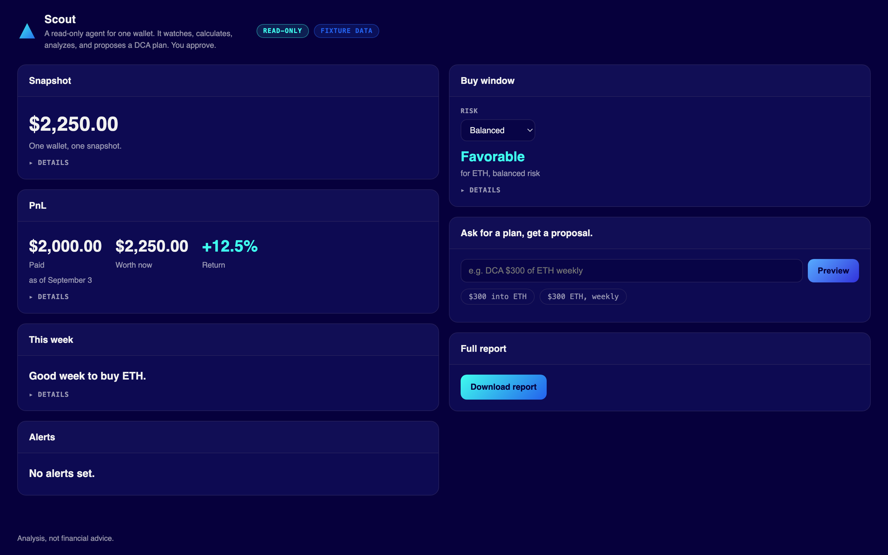

# Scout

Your agent should know what you own.

A read-only agent for one wallet. It watches, calculates, and proposes a DCA plan. You approve. It never signs, sends, or trades.

Built as a cat mascot: it won't press a button it doesn't want to.

## The problem

"I bought the dip. I don't know what I paid, when, or on which chain."

Wallets show activity. They don't tell a story.

## Install it with your agent

Clone or fork this repo. Then tell your own agent: "Install the Scout plugin from this folder, and run the demo."

**Claude Code**

```bash
claude plugin marketplace add /path/to/scout-portfolio-manager
claude plugin install scout-portfolio@scout-portfolio-manager
```

Then ask it: `/scout-portfolio:portfolio-intelligence What is my PnL?`

**Codex**

```bash
codex plugin marketplace add /path/to/scout-portfolio-manager/codex/.agents/plugins
codex plugin add scout-portfolio --marketplace scout-portfolio-manager
```

**Plain Python, no plugin host**

```bash
uv sync --extra test --extra mcp
uv run pytest -q
```

Every route, including the `pip`-only path and troubleshooting, is in [`START-HERE.md`](START-HERE.md).

## See it run

The demo runs on a fixture wallet. No API key needed. It shows a portfolio snapshot, an explainable PnL, and a DCA chat that stops at approval.

```bash
uv run --project . demo/zerion-portfolio-agent/server.py
```

Open `http://127.0.0.1:8787`.



Full walkthrough: [`demo/zerion-portfolio-agent/README.md`](demo/zerion-portfolio-agent/README.md).

## What Scout computes

Ask "What's the PnL, Scout?" and it answers with cost basis and current value, not a guess.

- Cost basis: 1 ETH bought for $2,000 on Aug 3, 2026.
- Current value: $2,250 in the Sept 3, 2026 snapshot.
- Result: +12.5%, current value minus basis minus fees.

Ask "DCA $300 into ETH, weekly" and Scout drafts a complete proposal: asset, amount, chain, schedule. Status: approval required.

## Where it stops

Execution boundary: not implemented in this host.

No trade button. No signing. No sending funds.

Execution is optional and coming: Scout will DCA for you or just alert you, your choice.

Full boundary and reporting: [`SECURITY.md`](SECURITY.md), [`DATA-AND-PRIVACY.md`](DATA-AND-PRIVACY.md).

## Optional: real wallet data through the Zerion API

Scout can also read one real wallet's holdings and transaction ledger through a read-only Zerion API adapter, instead of the fixture. It still can't sign, submit, or execute anything. Set `ZERION_API_KEY` and `ZERION_WALLET_ADDRESS` from your own secret manager (never paste a key inline), and Scout switches from the fixture to your wallet. Full setup, including the required environment variables, is in [`START-HERE.md`](START-HERE.md).

### Optional MCP server

Run it directly, without a plugin host: `uv run --extra mcp zpm-mcp`.

Tools registered: `get_portfolio_snapshot`, `get_pnl`, `parse_dca_request`, `preview_dca`, `analyze_asset`, `dca_windows`, `set_alert`, `check_alerts`. No wallet, signing, submission, or execution tool exists on this server.

`analyze_asset` reports SMA/EMA/RSI/drawdown for one held asset, with a heuristic disclosure attached. `dca_windows` classifies the current entry window for one asset and carries the line "This is analysis, not financial advice." `set_alert` stores a user-chosen price-threshold rule locally; `check_alerts` evaluates stored rules on demand and carries the same "This is analysis, not financial advice." line. None of the four executes, schedules itself, or runs in the background.

Run the full observe-through-alert chain unattended with [`skills/watch/SKILL.md`](skills/watch/SKILL.md), which fits a Claude Code `/loop` tick.

## Video

The video's source lives in `video/`, built with Remotion. Render it from inside that folder:

```bash
cd video && npx remotion render
```

Output lands in `video/out/`.

## More

- [`docs/ARCHITECTURE.md`](docs/ARCHITECTURE.md): how the boundary holds
- [`CHANGELOG.md`](CHANGELOG.md): release history
- [`SUPPORT.md`](SUPPORT.md): questions and issue reports
- [`LICENSE.md`](LICENSE.md): license
